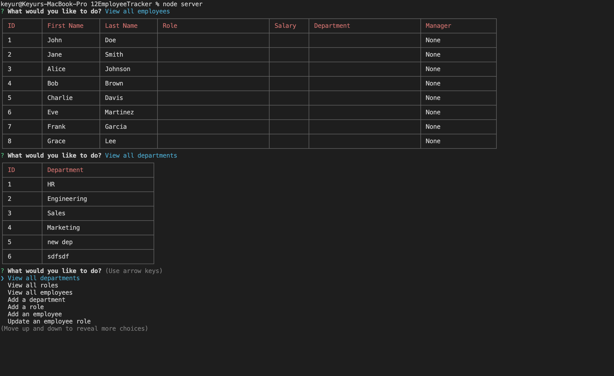

# 12EmployeeTracker

## Description

This Employee Tracker is a command-line application that allows users to manage a company's departments, roles, and employees. Users can view, add, update, and delete information about employees, roles, and departments.

## Links

* Github Repo: https://github.com/bryxzi/12EmployeeTracker
* Walkthrough Video: https://drive.google.com/file/d/1upvvjOU_Agb-QEe3iGQFNQAijEmUW45E/view

## Demo

## Table of Contents

- [Installation](#installation)
- [Usage](#usage)
- [Features](#features)
- [License](#license)

## Installation

1. Clone this repository to your local machine.
2. Navigate to the project folder using the command line.
3. Run `npm install` to install the required dependencies.

## Usage

1. In the command line, navigate to the project folder.
2. Run `node server` to start the application.
3. Use the arrow keys to navigate through the options and press Enter to select an option.
4. Follow the prompts to view, add, update, or delete data.
5. Select 'Exit' to quit the application.

## Features

- View all departments, roles, and employees
- Add new departments, roles, and employees
- Update employee roles and managers
- View employees by manager or department
- Delete departments, roles, and employees
- View the total utilized budget of a department

## License

This project is licensed under the MIT License.